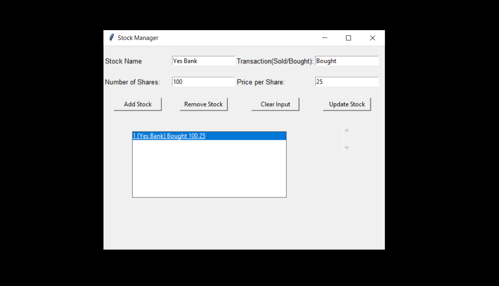

#STOCK MANAGER APP\
This app is made using python,tkinter library along with tkmessagebox and the database used to store the data is SQLite3.
To make this app,make sure you have the python 3.6+ or higher version and the pip package manager.\
Open your work folder and in the terminal add the following:\
For Virtual Environment setup:\
1)pip install pipenv\
2)pipenv shell\
Also install the following:\
pipenv install tkinter pyinstaller tkmessagebox\

